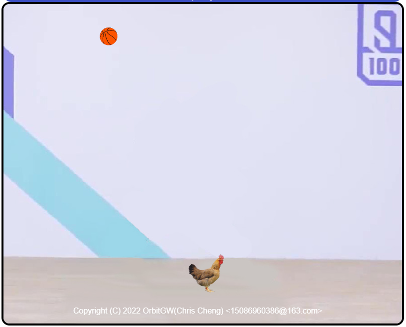

# Game - ZhiYin

This is a game project for 2022‘s CSDN 1024 Open Source Challenge.

## Preview

## Play

It's an web game, please open the `index.html` in your web-browser.

## Copyrgiht

Copyright (C) 2022 OrbitGW(Chris Cheng) <15086960386@163.com>

## LICENSE

This project is under MIT License.
